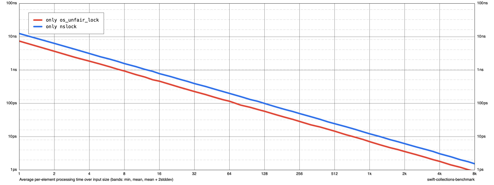

# Articles

A description of this package.

There's a side executable deliverable within the Articles package that creates a simple benchmark, just to poke at the difference in speed between
using os_unfair_lock and NSLock for the cache mechanism within DatabaseID.

It's easiest to run this from the command line:

    cd Articles
    rm results
    swift run -c release article-benchmark run --cycles 3 --max-size 50000 results
    swift run -c release article-benchmark render --linear-size results chart.png
    open chart.png
    

